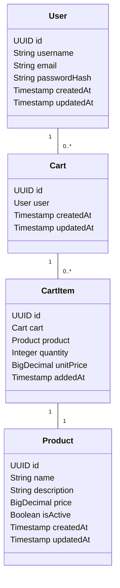
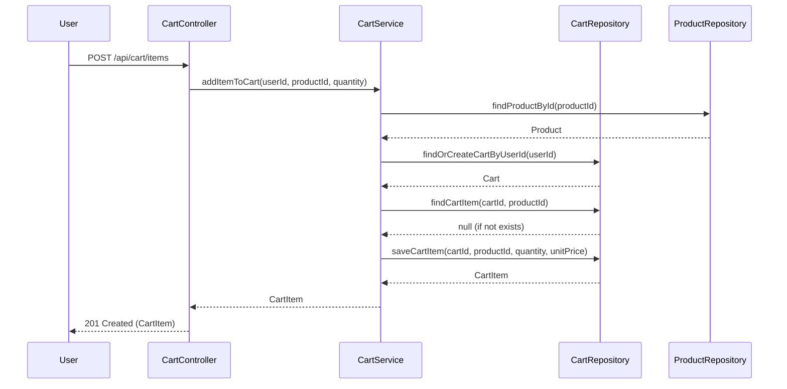

Executive Summary

This specification details the backend engineering design and low-level documentation (LLD) for the core Shopping Cart Backend Services as described in Jira Story SR-19. The system is to be implemented using Java Spring Boot (MVC architecture), exposing RESTful APIs and persisting data in a relational database. The scope includes user management, product search, and shopping cart operations, with strict enforcement of business rules and validations at both service and database layers. The system is stateless at login, and carts must not persist across logout. Checkout, payments, inventory locking, admin management, and password changes are explicitly out of scope.

---

Detailed Analysis

1. Functional Domains & Explicit Rules

- Functional Domains:
  - User Management (Registration, Login, Stateless Session)
  - Product Search (Catalog Browsing)
  - Shopping Cart Operations (Add/Remove/Update Items, View Cart, Cart Cleanup)

- Explicit Rules & Guardrails:
  - Stateless at login: No session persistence beyond authentication token.
  - Cart lifecycle: Cart is tied to user session; destroyed at logout.
  - Strict business rules: Cart constraints (e.g., no negative quantities, no duplicate items), cleanup logic (cart deletion on logout).
  - Database-first validation: All constraints enforced at DB and service layers.
  - Out of scope: Checkout, payments, inventory locking, admin management, password changes.

2. Domain Entities & Attributes

- User
  - id (UUID, PK)
  - username (String, unique)
  - email (String, unique)
  - password_hash (String)
  - created_at (Timestamp)
  - updated_at (Timestamp)

- Product
  - id (UUID, PK)
  - name (String)
  - description (String)
  - price (Decimal)
  - is_active (Boolean)
  - created_at (Timestamp)
  - updated_at (Timestamp)

- Cart
  - id (UUID, PK)
  - user_id (UUID, FK -> User)
  - created_at (Timestamp)
  - updated_at (Timestamp)

- CartItem
  - id (UUID, PK)
  - cart_id (UUID, FK -> Cart)
  - product_id (UUID, FK -> Product)
  - quantity (Integer, >0)
  - unit_price (Decimal, snapshot of Product.price)
  - added_at (Timestamp)

3. Required REST APIs

| Endpoint                | Method | Description                        | Auth | Business Logic |
|-------------------------|--------|------------------------------------|------|---------------|
| /api/users/register     | POST   | Register new user                  | No   | Validate unique username/email, hash password |
| /api/users/login        | POST   | Authenticate user, return JWT      | No   | Stateless, validate credentials |
| /api/products           | GET    | List/search products               | No   | Filter by name, is_active only |
| /api/cart               | GET    | Get current user's cart            | Yes  | Fetch or create cart for user |
| /api/cart/items         | POST   | Add item to cart                   | Yes  | Validate product, quantity, prevent duplicates |
| /api/cart/items/{id}    | PATCH  | Update quantity of cart item       | Yes  | Validate quantity, item ownership |
| /api/cart/items/{id}    | DELETE | Remove item from cart              | Yes  | Validate item ownership |
| /api/cart/clear         | POST   | Remove all items from cart         | Yes  | Clear all items for user cart |
| /api/users/logout       | POST   | Logout user, destroy cart          | Yes  | Delete cart, invalidate token |

4. Business Logic & Validation

- User registration: Unique username/email, password strength, hash password.
- Login: Stateless, JWT issued, no session storage.
- Product search: Only is_active products.
- Cart:
  - Only one active cart per user.
  - Cart destroyed on logout.
  - CartItem: No duplicate product per cart, quantity > 0, unit_price snapshot.
  - CartItem update: Only quantity allowed, must remain > 0.
  - CartItem delete: Only by cart owner.
  - Cart clear: Remove all items.
- All operations must validate user ownership and enforce DB constraints.

5. Error Cases

- 400 Bad Request: Invalid input, duplicate username/email, negative quantity, product not found, item not in cart.
- 401 Unauthorized: Invalid/missing JWT.
- 403 Forbidden: Access to another user's cart/item.
- 404 Not Found: Resource does not exist.
- 409 Conflict: Duplicate cart item.

6. Database Effects

- User: Insert on registration.
- Product: Read-only for this scope.
- Cart: Insert on first cart access, delete on logout.
- CartItem: Insert on add, update on quantity change, delete on remove/clear.

---

Deliverables

A. Domain Entities

```java
// User.java
@Entity
public class User {
    @Id UUID id;
    @Column(unique=true) String username;
    @Column(unique=true) String email;
    String passwordHash;
    Timestamp createdAt;
    Timestamp updatedAt;
}

// Product.java
@Entity
public class Product {
    @Id UUID id;
    String name;
    String description;
    BigDecimal price;
    Boolean isActive;
    Timestamp createdAt;
    Timestamp updatedAt;
}

// Cart.java
@Entity
public class Cart {
    @Id UUID id;
    @ManyToOne User user;
    Timestamp createdAt;
    Timestamp updatedAt;
}

// CartItem.java
@Entity
public class CartItem {
    @Id UUID id;
    @ManyToOne Cart cart;
    @ManyToOne Product product;
    Integer quantity;
    BigDecimal unitPrice;
    Timestamp addedAt;
}
```

B. API Contracts

```yaml
# OpenAPI 3.0 YAML (excerpt)

paths:
  /api/users/register:
    post:
      summary: Register new user
      requestBody:
        required: true
        content:
          application/json:
            schema:
              type: object
              properties:
                username: { type: string }
                email: { type: string, format: email }
                password: { type: string, format: password }
      responses:
        '201': { description: User created }
        '400': { description: Invalid input or duplicate user }

  /api/users/login:
    post:
      summary: Authenticate user
      requestBody:
        required: true
        content:
          application/json:
            schema:
              type: object
              properties:
                username: { type: string }
                password: { type: string }
      responses:
        '200': { description: JWT token }
        '401': { description: Invalid credentials }

  /api/products:
    get:
      summary: List/search products
      parameters:
        - in: query
          name: q
          schema: { type: string }
          description: Search term
      responses:
        '200': { description: List of products }

  /api/cart:
    get:
      summary: Get current user's cart
      security: [ { bearerAuth: [] } ]
      responses:
        '200': { description: Cart details }
        '401': { description: Unauthorized }

  /api/cart/items:
    post:
      summary: Add item to cart
      security: [ { bearerAuth: [] } ]
      requestBody:
        required: true
        content:
          application/json:
            schema:
              type: object
              properties:
                productId: { type: string }
                quantity: { type: integer, minimum: 1 }
      responses:
        '201': { description: Item added }
        '400': { description: Invalid input }
        '409': { description: Duplicate item }

  /api/cart/items/{id}:
    patch:
      summary: Update quantity of cart item
      security: [ { bearerAuth: [] } ]
      parameters:
        - in: path
          name: id
          required: true
          schema: { type: string }
      requestBody:
        required: true
        content:
          application/json:
            schema:
              type: object
              properties:
                quantity: { type: integer, minimum: 1 }
      responses:
        '200': { description: Item updated }
        '400': { description: Invalid quantity }
        '404': { description: Item not found }

    delete:
      summary: Remove item from cart
      security: [ { bearerAuth: [] } ]
      parameters:
        - in: path
          name: id
          required: true
          schema: { type: string }
      responses:
        '204': { description: Item removed }
        '404': { description: Item not found }

  /api/cart/clear:
    post:
      summary: Remove all items from cart
      security: [ { bearerAuth: [] } ]
      responses:
        '204': { description: Cart cleared }

  /api/users/logout:
    post:
      summary: Logout user, destroy cart
      security: [ { bearerAuth: [] } ]
      responses:
        '204': { description: Logged out, cart destroyed }
```

C. Validation Matrix

| Field/API                 | Validation Rule                                      | Error Code |
|---------------------------|------------------------------------------------------|------------|
| username (register)       | Required, unique, min 3 chars                        | 400, 409   |
| email (register)          | Required, unique, valid email                        | 400, 409   |
| password (register)       | Required, min 8 chars, complexity                    | 400        |
| login                     | Valid credentials                                    | 401        |
| productId (cart add)      | Exists, is_active                                    | 400, 404   |
| quantity (cart add/update)| Integer > 0                                          | 400        |
| cart item (add)           | Not duplicate product in cart                        | 409        |
| cart item (update/delete) | Item exists, belongs to user                         | 404, 403   |
| cart clear                | Cart exists, belongs to user                         | 404, 403   |
| logout                    | Authenticated, destroy cart                          | 401        |

D. Mermaid Diagrams

Class Diagram:


Sequence Diagram (Add Item to Cart):


E. LLD Documentation

- Controller Layer:
  - UserController: register(), login(), logout()
  - ProductController: listProducts()
  - CartController: getCart(), addItem(), updateItem(), removeItem(), clearCart()

- Service Layer:
  - UserService: registerUser(), authenticate(), logout()
  - ProductService: searchProducts()
  - CartService: getCart(), addItemToCart(), updateCartItem(), removeCartItem(), clearCart(), destroyCartOnLogout()

- Repository Layer:
  - UserRepository: findByUsername(), findByEmail(), save()
  - ProductRepository: findById(), searchByName(), findActive()
  - CartRepository: findByUserId(), save(), delete()
  - CartItemRepository: findByCartAndProduct(), save(), delete(), findAllByCart()

- Business Logic Sequencing:
  - On login: authenticate, issue JWT, no session state.
  - On cart access: fetch or create cart for user.
  - On add item: validate product, check for duplicates, enforce quantity, snapshot price.
  - On update item: validate ownership, enforce quantity.
  - On remove/clear: validate ownership, delete item(s).
  - On logout: delete cart, invalidate token.

- Validation & Error Handling:
  - All endpoints validate input and user ownership.
  - Service layer throws domain-specific exceptions mapped to HTTP error codes.
  - DB layer enforces unique constraints and referential integrity.

---

Implementation Guide

1. Scaffold Spring Boot project with MVC, JPA, and JWT dependencies.
2. Define entities and repositories as per domain model.
3. Implement service layer with business logic and validations.
4. Implement controllers mapping to REST API contracts.
5. Configure JWT authentication and stateless session handling.
6. Enforce DB constraints (unique, foreign keys, cascade deletes).
7. Write unit and integration tests for all service and controller logic.
8. Document API with OpenAPI/Swagger.

---

Quality Assurance Report

- All fields and flows validated against business rules and explicit out-of-scope constraints.
- Domain model normalized and mapped to relational DB with referential integrity.
- API contracts cover all required operations and error cases.
- Validation matrix ensures all input and ownership rules are enforced.
- Diagrams and LLD provide complete implementation guidance.
- No session state or cart persistence across logout, as required.

---

Troubleshooting and Support

- Common Issues:
  - Duplicate user registration: Check unique constraints.
  - Cart not found: Ensure cart is created on first access.
  - Unauthorized access: Validate JWT and user ownership.
  - Cart not cleared on logout: Ensure destroyCartOnLogout() is called.
- Logging and error handling: All exceptions logged with context, user-friendly error messages returned.

---

Future Considerations

- Add checkout, payment, and inventory locking flows.
- Implement admin management and password change features.
- Support for promotions, discounts, and wishlists.
- Scalability: Consider distributed cache for product catalog, sharding for large user base.
- Security: Rate limiting, stronger password policies, audit logs.

This package provides a comprehensive, production-ready backend engineering specification for the core shopping cart backend services as described in SR-19, ready for downstream engineering implementation.